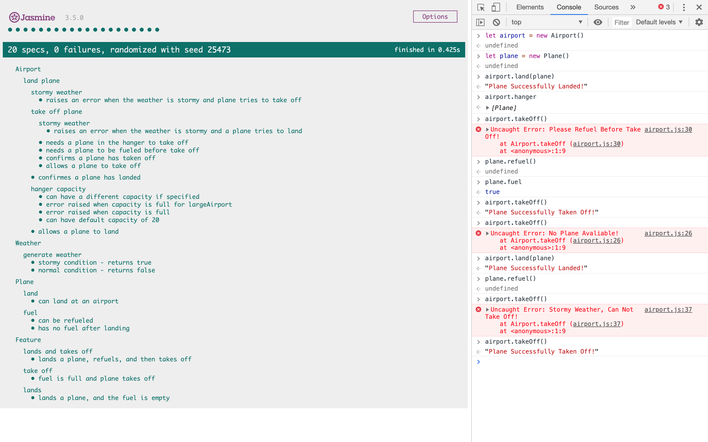

# London Airport

A simple Object Orientated app, simulating an airport - functions via the console on a web browser. Test driven in JavaScript ES6 with the Jasmine library, this showcases good coding prncipals: Encapsulation, DRY, SRP, TDD. Built on the a set of user stories. The 'spyOn' feature of Jasmine was also used to seperate the concerns of the spec files, spyOnObj was used for test doubles, to unit test in isolation, and a grouped feature test was conducted with the real objects to thoroughly test the entire program.

---

## User Stories

```
As an air traffic controller
So I can get passengers to a destination
I want to instruct a plane to land at an airport

As an air traffic controller
So I can get passengers on the way to their destination
I want to instruct a plane to take off from an airport and confirm that it is no longer in the airport

As an air traffic controller
To ensure safety
I want to prevent landing when the airport is full

As the system designer
So that the software can be used for many different airports
I would like a default airport capacity that can be overridden as appropriate

As an air traffic controller
To ensure safety
I want to prevent takeoff when weather is stormy

As an air traffic controller
To ensure safety
I want to prevent landing when weather is stormy
```

---

## How to Run

Clone this repo, and from the command line navigate to the [_London Airport_](london_airport).

Right click on the `SpecRunner.html` file and select `Copy Path`. Paste this into the Google Chrome Web Browser.

Right click, and open the chrome Developer Tools by selecting `Inspect`. Clcik the `Console` tab at the top. You can then type in the following:

```
let plane = new Plane()
let airport = new Airport()

```

This will instantiate the objects needed for the program. You can then type in the following to action the objects accordingly:

```
airport.land(plane)
plane.refuel()
airport.takeOff()
```

If the weather is stormy during landing or take off, an error will be thrown. If there is not a plane avaliable in the hangar, an error will be thrown. If a plane has not been fueled before take off, an error will be thrown. Messages will be shown when a sucessful landing or take off has happened.

## Testing

To run the test suite (Jasmine), follow the instructions above to open the SpecRunner. The Jasmine test suite will appear with 20 passing tests and 100% coverage.

---

### Jasmine Test Suite and Console Example



---
